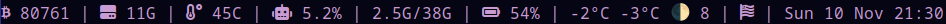

# DWMBLOCKS

My custom dwmblocks build.

Modular status bar for dwm written in c.


## Usage

To use dwmblocks:

```shell
git clone https://github.com/misterjoswald/dwmblocks.git
cd dwmblocks
make
sudo make install
```

After that you can put dwmblocks in your **xinitrc** or other startup script to have it start with dwm.

### Modifying blocks

The statusbar is made from text output from commandline programs.
Blocks are added and removed by editing the **blocks.h** header file.

##### My modifying **blocks.h** file:

```c
//Modify this file to change what commands output to your statusbar, and recompile using the make command.
static const Block blocks[] = {
    /*Icon*/    /*Command*/        /*Update Interval*/    /*Update Signal*/
     {" ", "curl -s 'https://api.binance.com/api/v1/ticker/price?symbol=BTCUSDT' | cut -d: -f3 | sed 's/\"//g; s/}//g' | awk '{print int($1+0.5)}'", 600, 0},
    {" ", "df -h  /dev/nvme0n1p3 --output=used | grep G | awk '{ print $1 }'", 600, 0},
    {" ", "echo \"$(cat /proc/acpi/ibm/thermal| awk '{print $2}')C\"", 30, 0},
    {" ", "echo \"$(top -b -n1 | grep 'Cpu(s)' | awk '{print $2 + $4}')%\"", 30, 0},
    {"", "free -h | awk '/^Mem/ { print $3\"/\"$2 }' | sed s/i//g",    30,        0},
    {" ", "echo \"$(cat /sys/class/power_supply/BAT0/capacity)%\"",          15,             0},
    {"", "curl -s 'wttr.in/Petersburg?format='%t+%f+%m+%M''", 300, 0},
    {"", "xset -q|grep LED| awk '{ if (substr ($10,5,1) == 1) print \"Z\"; else print \"\"; }'", 0, 1},
    {"", "date '+%a %d %b %R'",                            60,        0},
};

//sets delimiter between status commands. NULL character ('\0') means no delimiter.
static char delim[] = " | ";
static unsigned int delimLen = 5;
```

##### Output indicators



- Bitcoin rate

- Used hard disk space

- CPU temperature

- CPU load

- Memory load

- Battery charge level

- Temperature, temperature sensations, moon phase, moon phase day

- Keyboard layout (ENG/RUS) 
  
  *NB! To switch the layout, add hot keys to the dwm configuration file (**config.h** - dwm)*
  
  ```c
  { ControlMask,                  XK_space,                  spawn,  SHCMD("pkill -RTMIN+1 dwmblocks") },
      T
  ```
  
  [Link to the original dwm assembly - github](https://github.com/torrinfail/dwmblocks)
